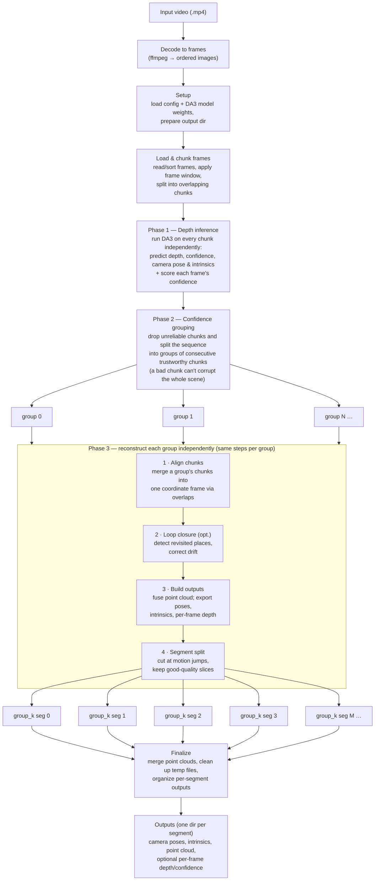

# DA3-Streaming Pipeline

This document traces one full run of `da3_streaming.py` — from a directory of
video frames on disk to the final per-group / per-segment outputs — and maps
each stage to the code that implements it.

## Input / Output at a glance

**Input**: a **video** (e.g. `.mp4`). The pipeline itself consumes ordered image
frames, so the video is first decoded into a directory of frames named
`000001.png`, `000002.png`, … (the README uses `ffmpeg`, e.g.
`ffmpeg -i your_video.mp4 -vf "fps=5,scale=640:-1" ./extract_images/frame_%06d.png`).
That frame directory is passed to `da3_streaming.py` via `--image_dir`.
Optional inputs: a `--mask_dir` of binary masks and a `--first_frame` /
`--last_frame` frame-id window.

**Output** (under `--output_dir`, or an auto-timestamped `./exps/...` dir):
per **group** and per **segment** subdirectories, each containing camera poses,
intrinsics, a point cloud, and optional per-frame depth/confidence files.

## High-level flow



> Each group from Phase 2 runs through the **same** four Phase-3 steps
> independently (they don't share a coordinate frame). The diagram shows the
> steps once; they repeat per group. Just as Phase 2 fans a clip out into
> groups, **Step 4 fans each group out into a list of segments** (`group_k_0`,
> `group_k_1`, …) — the final output units (0+ per group; a group is dropped if
> none pass the quality filter). Segment splitting is enabled by default in
> `base_config.yaml`; if disabled, each group itself is the output unit.

## Stage-by-stage detail

Each stage below links to its code and explains *what it does* and *why*.

### 0. Entry point
**Code:** [`__main__`](Depth-Anything-3/da3_streaming/da3_streaming.py#L656)

Wires the run together: parses CLI args (only `--image_dir` is required), loads
the YAML config, and resolves the relative `Weights` paths (`DA3`, `DA3_CONFIG`,
`SALAD`) against the script dir so they work regardless of the current working
directory. It decides where output goes (`--output_dir`, else an auto-timestamped
`./exps/<image_dir>/<timestamp>` dir, wiping any pre-existing one), optionally
JIT-warms the numba CPU aligner, then constructs `DA3_Streaming` and drives the
three top-level calls: `.run()` → `.close()` → `merge_point_clouds()`.

### 1. Construction
**Code:** [`DA3_Streaming.__init__`](Depth-Anything-3/da3_streaming/da3_streaming.py#L66) → [`_prepare_for_da3_inference`](Depth-Anything-3/da3_streaming/da3_streaming.py#L222)

Loads the DA3 model + safetensors weights onto GPU (or CPU) once, so the same
model instance serves every chunk. Creates the `_tmp_results_unaligned/` scratch
dir and initializes the lists that accumulate per-chunk camera poses, intrinsics,
and confidence flags across Phase 1. Loading the model here (not per chunk) is
what makes the streaming loop cheap.

### 2. Frame loading
**Code:** [`_load_image_list`](Depth-Anything-3/da3_streaming/da3_streaming.py#L567)

Turns the frame directory into an ordered work list: `sorted(glob(*.jpg) +
glob(*.png))`, erroring if the dir is empty. If `--first_frame` / `--last_frame`
are given, it maps those frame **ids** to filenames (`%06d.<ext>`) and slices the
list (first inclusive, last exclusive) so you can process just a window of a long
video without re-encoding it.

### 3. Chunking
**Code:** [`get_chunk_indices`](Depth-Anything-3/da3_streaming/da3_streaming.py#L350)

Splits the frame list into the fixed-size, **overlapping** windows the model
processes. Step size is `chunk_size - overlap` (default 120/60 → 50% overlap);
the shared overlap frames are what later lets Phase 3 align neighboring chunks.
A short clip (`≤ chunk_size` frames) collapses to a single chunk covering
everything.

### Phase 1 — Depth inference
**Code:** [`_run_da3_inference`](Depth-Anything-3/da3_streaming/da3_streaming.py#L545) → [`process_single_chunk`](Depth-Anything-3/da3_streaming/da3_streaming.py#L279)

Runs the DA3 model on **every chunk up front, independently** — the key design
choice from [confidence_filtering.md](Depth-Anything-3/da3_streaming/confidence_filtering.md): each chunk's prediction never
references another chunk, so all inference can happen before any alignment. Per
chunk it:
1. calls `model.inference(...)` → `depth [N,H,W]`, `conf [N,H,W]`, `extrinsics
   [N,3,4]` (world-to-cam), `intrinsics [N,3,3]`, `processed_images`;
2. rebases confidence (`conf -= 1.0`) so its minimum is 0, and optionally zeroes
   masked-out pixels via [`apply_mask_to_confidence`](Depth-Anything-3/da3_streaming/confidence.py#L21);
3. scores each frame's confidence into a keep/drop flag via
   [`aggregate_pixel_to_frame_confidence`](Depth-Anything-3/da3_streaming/confidence.py#L57) (75th-percentile pixel conf vs
   `frame_confidence_threshold`);
4. saves the prediction to `chunk_<i>.npy` **on disk** (not in memory) and
   appends the poses/intrinsics/flags — this streaming-to-disk is what keeps the
   memory budget flat over long videos.

### Phase 2 — Confidence grouping
**Code:** [`compute_chunk_confidence_groups`](Depth-Anything-3/da3_streaming/confidence.py#L109)

Decides *which chunks to trust and how they clump*. It marks a chunk as bad
([`aggregate_frame_to_chunk_confidence`](Depth-Anything-3/da3_streaming/confidence.py#L79)) when it contains a continuous run of
low-confidence frames ≥ `drop_continuous_ratio` of its length, then partitions
the kept chunks into **groups of consecutive good chunks** — a bad chunk breaks
the sequence — and discards groups smaller than `min_chunks_per_group`. The point
is that Phase 3 aligns chunks *sequentially*, so one bad chunk would poison every
alignment built on top of it; splitting at bad boundaries keeps each group
independently trustworthy. If nothing survives, post-processing is skipped.

### Phase 3 — Per-group reconstruction
**Code:** [`process_long_sequence`](Depth-Anything-3/da3_streaming/da3_streaming.py#L485) (the per-group loop) → [`_run_post_processing`](Depth-Anything-3/da3_streaming/da3_streaming.py#L555)

After Phases 1–2 each group is a set of chunks that are *locally* correct but sit
in their own per-chunk frames at their own scale. Phase 3 stitches each group
into one consistent frame, removes drift, emits the deliverables, and carves the
result into motion-consistent segments — **independently for every group**.

**Step 0 · Setup** — [`_prepare_for_group`](Depth-Anything-3/da3_streaming/da3_streaming.py#L164)
Rebases everything to group-local coordinates: re-numbers this group's chunk
indices to start at 0, slices `img_list` to just its frames, remaps the stored
poses/intrinsics, points `output_dir` at `group_<k>/`, and (via
[`_prepare_for_alignment`](Depth-Anything-3/da3_streaming/da3_streaming.py#L98)) creates fresh temp/output dirs and a **fresh** loop
detector + `Sim3LoopOptimizer`. This fresh state is *why* groups never share a
coordinate frame or leak into one another.

**Step 1 · Align chunks** — [`run_cross_chunk_alignment`](Depth-Anything-3/da3_streaming/alignment.py#L92)
This is the **sequential/local** stitch: it aligns only **adjacent** chunk pairs
— (0,1), (1,2), (2,3), … — using the frames they *literally share* from the 50%
chunk overlap. For each pair it converts both chunks' depth maps to 3D point
clouds, takes the shared overlap frames, and estimates a confidence-weighted
**SIM(3)** transform (scale `s`, rotation `R`, translation `t`) mapping chunk
*N+1* onto chunk *N* ([`align_2pcds`](Depth-Anything-3/da3_streaming/alignment.py#L36)). Scale is part of the transform because
monocular depth is scale-ambiguous — each chunk can be at a different scale, and
this reconciles them into a **chain** of pairwise transforms (`sim3_list`). This
chain is what builds a single coordinate frame, but each link only "sees" its
immediate neighbor, so small per-pair errors **accumulate as drift** along the
trajectory — which is exactly what Step 2 corrects.

**Step 2 · Loop closure (optional)** — [`_run_loop_closure_optimization`](Depth-Anything-3/da3_streaming/da3_streaming.py#L393)
This is the **non-sequential/global** correction. Unlike Step 1, it connects
**temporally distant** chunks that revisit the *same place* (e.g. the camera
loops back to a spot seen hundreds of frames earlier) — pairs that share no
frames, so they're matched by **visual similarity** rather than overlap. SALAD
place-recognition finds these revisits **within the group**; each loop pair is
re-inferred and turned into a "these two points are actually the same" constraint
fed to a pose-graph optimizer that globally re-distributes the accumulated drift
across all chunk transforms, snapping the loop shut, and saves a before/after
plot (`sim3_opt_result.png`). So Step 1 guarantees connectivity while Step 2
removes the drift that connectivity alone can't see. Loops are sought only within
a group, since groups don't share a coordinate frame.

**Step 3 · Build outputs** — [`apply_alignment`](Depth-Anything-3/da3_streaming/alignment.py#L343) + [`save_camera_poses`](Depth-Anything-3/da3_streaming/output.py#L246)
Accumulates the pairwise transforms into absolute transforms relative to chunk 0
(the group's identity reference), applies them to pull every chunk into that one
frame, then writes the deliverables: per-chunk aligned point-cloud PLYs;
`camera_poses.txt` (4×4 cam-to-world); `intrinsic.txt`; `camera_absolute_poses.json`
(re-expressed in a **ground-plane navigation convention** — x/y on the ground, z
up, plus yaw heading); `camera_poses.ply` (frustum viz); and optionally per-frame
depth/conf/intrinsics `.b2nz` files. [`_write_group_info`](Depth-Anything-3/da3_streaming/da3_streaming.py#L270) also drops a
`group_info.json` recording the frame range and chunk ids.

**Step 4 · Segment splitting (optional)** — [`split_group_into_segments`](Depth-Anything-3/da3_streaming/delta_splitting.py#L612)
Even a confident group can contain a motion discontinuity (e.g. alignment glued
two stretches with a jump). Using `camera_absolute_poses.json`, it computes
frame-to-frame translation deltas and **splits** wherever a delta spikes — above
`max_delta_threshold` or ≫ the local rolling average — then **quality-filters**
the segments: dropping too-short ones (`min_frames`), too-static ones
(`min_p50_delta`), or too-fast ones (`max_p50_delta`). Each surviving segment
becomes its own `group_<k>_<j>/` dir; a group with no valid segment is deleted.

### Cleanup & merge
**Code:** [`close`](Depth-Anything-3/da3_streaming/da3_streaming.py#L622) + [`merge_point_clouds`](Depth-Anything-3/da3_streaming/geometry_utils.py#L114)

Final housekeeping. If no `group_*` dirs remain (nothing survived), the clip dir
is [removed](Depth-Anything-3/da3_streaming/da3_streaming.py#L539). `close()` deletes the scratch dirs (`_tmp_results_unaligned`
and the per-group aligned/loop dirs) when `delete_temp_files` is set, reporting
reclaimed space. `merge_point_clouds()` then fuses each parent group's per-chunk
PLYs into `pcd/combined_pcd.ply`; if the group was split into segments, it copies
that combined cloud into each segment's `pcd/` and deletes the now-redundant
parent group dir — leaving segments (or ungrouped groups) as the final output
units.

## Key config knobs (`configs/base_config.yaml`)
- `Model.chunk_size` / `overlap` — chunking (120 / 60).
- `Model.loop_enable` — loop closure on/off.
- `Model.align_lib` / `align_method` — SIM(3) backend and formulation.
- `Model.save_depth_conf_result` — whether to emit per-frame `.b2nz` files.
- `Confidence.*` — Phase 2 chunk keep/drop and grouping thresholds.
- `DeltaSplitting.*` — Phase 3 motion-based segment splitting and quality filter.
- `Loop.SALAD.*` / `Loop.SIM3_Optimizer.*` — loop detection + pose-graph opt.

## Output tree

### Default (grouping + segmenting enabled)
Segments are the final output units; the parent `group_<k>/` dirs are deleted
during `merge_point_clouds()` after their point cloud is distributed.
```
<save_dir>/
  group_0_0/                     # segment 0 of group_0
    camera_poses.txt             # 4x4 cam-to-world matrix per frame (16 floats/line)
    intrinsic.txt                # fx fy cx cy per frame
    camera_absolute_poses.json   # ground-plane x/y/z + yaw per frame
    camera_poses.ply             # camera frustum visualization
    group_info.json              # frame range, parent group / chunk ids
    loop_closures.txt            # detected loop pairs (copied from parent)
    sim3_opt_result.png          # before/after loop-closure plot (copied from parent)
    pcd/
      combined_pcd.ply           # fused point cloud for this segment's group
    depth_per_frame/             # only if Model.save_depth_conf_result: True
      frame_<id>.b2nz            # per-frame depth + conf + intrinsics (blosc2)
      ...
  group_0_1/                     # segment 1 of group_0 (same layout)
    ...
  group_1_0/                     # segment 0 of group_1
    ...
  # parent group_0/, group_1/ are deleted after PCD distribution
```

### Segment splitting disabled (`DeltaSplitting.enable: False`)
The **group** itself is the output unit. Same files, except per-frame depth lives
in `results_output/` and `pcd/` also keeps the per-chunk PLYs before/besides the
merged one:
```
<save_dir>/
  group_0/
    camera_poses.txt
    intrinsic.txt
    camera_absolute_poses.json
    camera_poses.ply
    group_info.json
    loop_closures.txt
    sim3_opt_result.png
    pcd/
      combined_pcd.ply           # merged from the per-chunk PLYs below
      0_pcd.ply, 1_pcd.ply, ...  # per-chunk clouds (merged, then removed on merge)
    results_output/              # only if Model.save_depth_conf_result: True
      frame_<id>.b2nz            # per-frame depth + conf + intrinsics (blosc2)
      ...
  group_1/
    ...
```
Read a `.b2nz` file back with [`load_blosc2_npz`](Depth-Anything-3/da3_streaming/output.py#L72); the README also shows
fusing `results_output/` into a single `output.ply` via `npz_output_process.py`.
